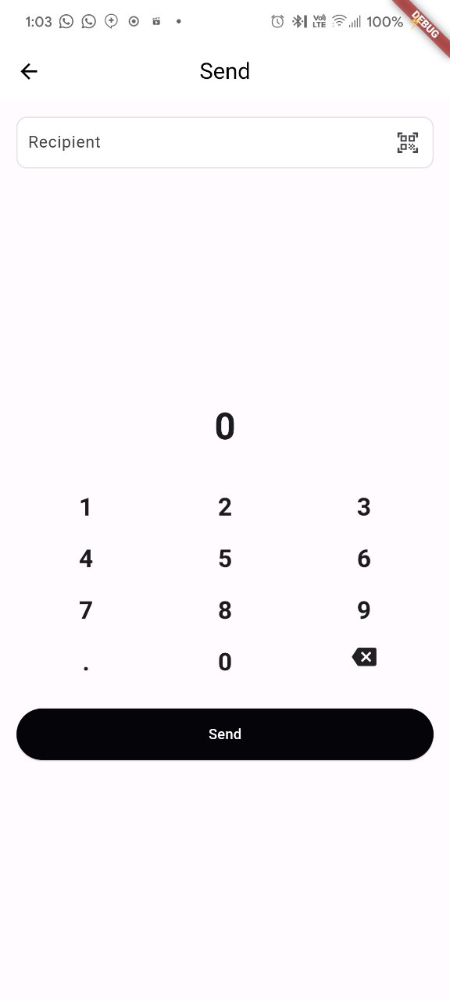

# Flutter Wallet Application

## Overview

This Flutter application mimics the wallet functionality found in the Vible Wallet App. The app allows users to create wallets, transfer balances, retrieve balances, and request airdrops by integrating with the provided APIs.

## Key Features

- **Wallet Creation**: Users can create new wallets.
- **Balance Transfer**: Users can transfer balance to other wallets.
- **Balance Retrieval**: Users can check their wallet balance.
- **Airdrop Requests**: Users can request airdrops to their wallet.
- **User Authentication**: Login functionality to secure user operations.

## Screenshots


### Splash Screen


### Home Screen


### Create Wallet Onboarding


### Login Screen


### Profile Screen


### Create Wallet


### Wallet Screen


### Transfer Balance Screen



## API Integration

The app integrates with the following APIs:

- **Create Wallet**: `POST https://api.socialverseapp.com/solana/wallet/create`
- **Transfer Balance**: `POST https://api.socialverseapp.com/solana/wallet/transfer`
- **Retrieve Balance**: `GET https://api.socialverseapp.com/solana/wallet/balance`
- **Request Airdrop**: `POST https://api.socialverseapp.com/solana/wallet/airdrop`
- **Login**: `POST https://api.socialverseapp.com/user/login`

## Project Structure
```
.
├── lib
├── ├── logic
├── ├── models
├── │   ├── airdrop_request.dart
├── │   ├── airdrop_request.freezed.dart
├── │   ├── airdrop_request.g.dart
├── │   ├── airdrop_response.dart
├── │   ├── airdrop_response.freezed.dart
├── │   ├── airdrop_response.g.dart
├── │   ├── balance_response.dart
├── │   ├── balance_response.freezed.dart
├── │   ├── balance_response.g.dart
├── │   ├── balance_transfer_request.dart
├── │   ├── balance_transfer_request.freezed.dart
├── │   ├── balance_transfer_request.g.dart
├── │   ├── login_response.dart
├── │   ├── transfer_balance_response.dart
├── │   ├── transfer_balance_response.freezed.dart
├── │   ├── transfer_balance_response.g.dart
├── │   ├── wallet_response.dart
├── │   ├── wallet_response.freezed.dart
├── │   ├── wallet_response.g.dart
├── ├── providers
├── │   ├── wallet_provider.dart
├── ├── services
├── │   ├── api_service.dart
├── │   ├── dio_factory.dart
├── ├── ui
├── │   ├── home
├── │   │   ├── home_page.dart
├── │   │   ├── home_screen.dart
├── │   │   ├── profile_screen.dart
├── │   │   ├── request_airdrop.dart
├── │   │   ├── splash_screen.dart
├── │   │   ├── vible_page.dart
├── │   │   ├── wallet_screen.dart
├── │   ├── login
├── │   │   ├── login_screen.dart
├── │   ├── wallet
├── │   │   ├── create_wallet_screen.dart
├── │   │   ├── transfer_balance_screen.dart
├── │   │   ├── wallet_onboard_screen.dart
├── ├── widgets
├── │   ├── sa_button.dart
├── │   ├── apiBase.dart
└── ├── main.dart
```


## Detailed Explaination

- [API Integration Details](ApiIntegration.md)
- [State Management Details](ProviderManagement.md)
